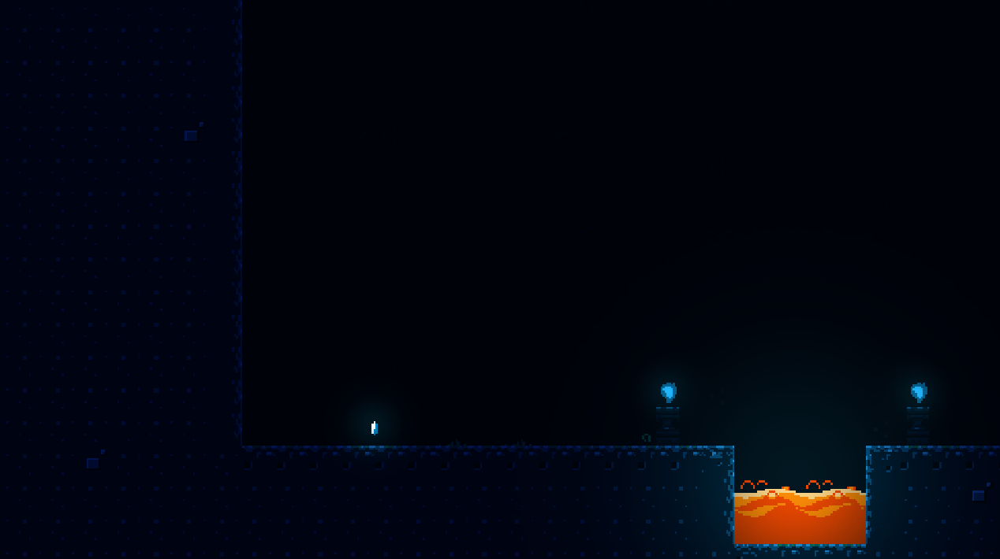

# Unfolding Defold Tutorial - Simplest Lighting

Then it was followed by tutorial on the [youtube.com/@unfolding_gamedev](https://youtube.com/@unfolding_gamedev) channel on making a simple lighting post-processing for games called "Screen Space Light Maps."

Expected result:

The idea is the same as presented and thoroughly explained here on [official Defold example](https://github.com/britzl/publicexamples/tree/master/examples/simple_lights).

If you run into trouble, help is available in [Defold forum](https://forum.defold.com).

You can use this project for all purposes, noncommercial and commercial!

The visual assets ussed as a mockup are from Luis Zuno [ansimuz](https://ansimuz.itch.io/grotto-escape-game-art-pack)

Happy Defolding!

---